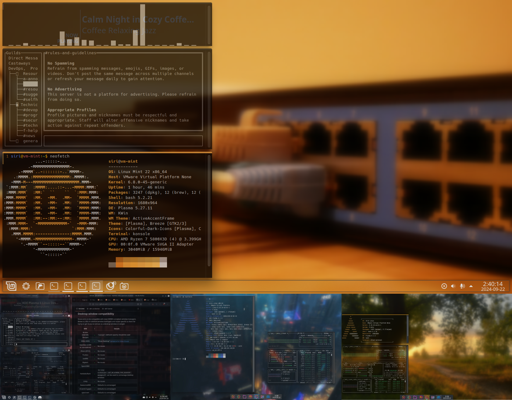

# dotfiles

Personal dotfile collection for Linux desktop personalization.

## Prerequisites

- **KDE Plasma 6** - Desktop Environment
  - [KDE Plasma Desktop](https://kde.org/de/plasma-desktop/)

- **Sugar Candy** - SDDM Theme
  - [Framagit](https://framagit.org/MarianArlt/sddm-sugar-candy)

- **Klassy** - Global Theme
  - [GitHub](https://github.com/paulmcauley/klassy)

- **Candy Icons** - Icon Pack
  - [KDE Store](https://store.kde.org/p/1305251/)
  - [GitHub](https://github.com/EliverLara/candy-icons)

- **Colorful Dark Icons** - Icon Pack
  - [KDE Store](https://store.kde.org/p/2091068)
  - [GitHub](https://github.com/L4ki/Colorful-Plasma-Themes)

- **Active accent border** - Window decorations
  - [KDE Store](https://store.kde.org/p/2118297)
  - [GitHub](https://github.com/nclarius/Plasma-window-decorations)

- **Active Blur** - Wallpaper effect plugin
  - [KDE Store](https://store.kde.org/p/2134907)
  - [GitHub](https://github.com/bouteillerAlan/blurredwallpaper)

- **KZones** - KWin Script
  - [KDE Store](https://store.kde.org/p/1909220)
  - [GitHub](https://github.com/gerritdevriese/kzones)

- **pywal16** - Color scheme generator
  - [GitHub](https://github.com/eylles/pywal16)

- **Latte Dock** - Dock replacement
  - [GitHub](https://github.com/KDE/latte-dock)

---
