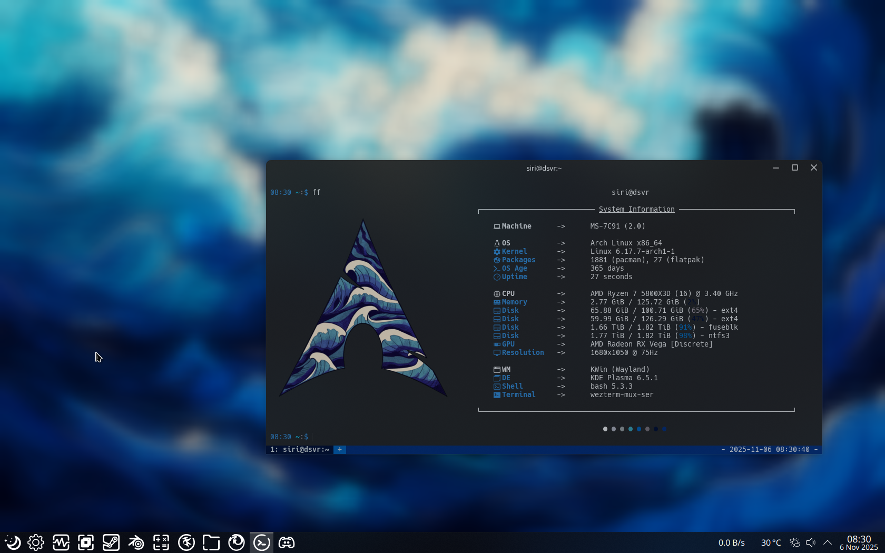
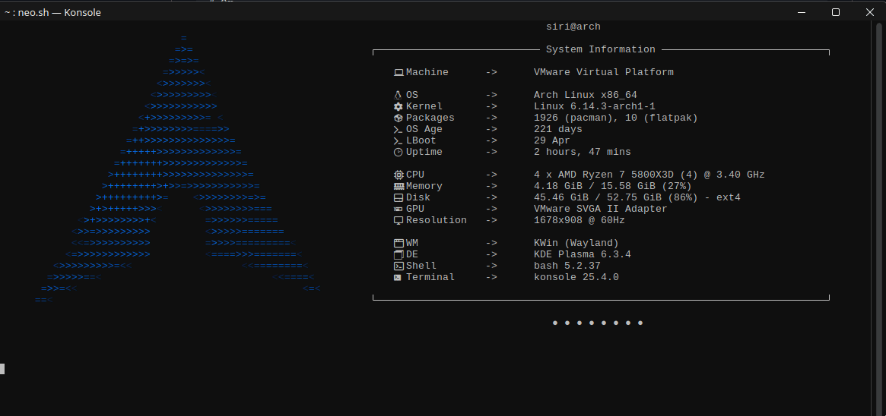
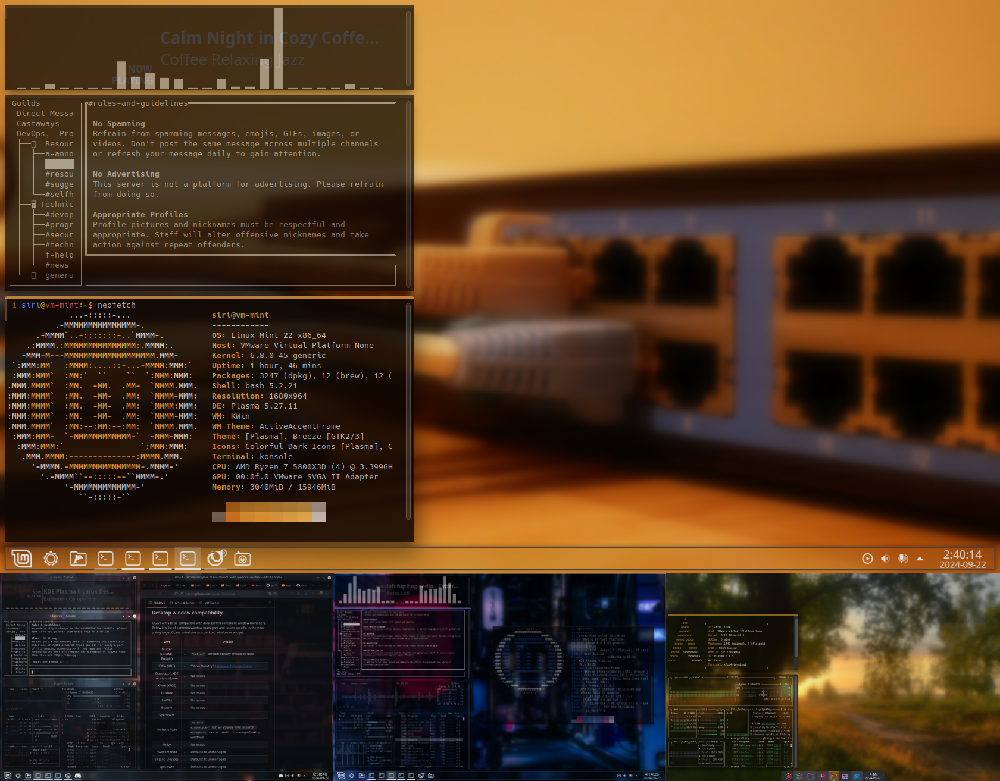

# dotfiles

Personal collection of dotfiles for linux desktop personalization.








## Prerequisites

- **KDE Plasma** - Desktop Environment
  - [KDE Plasma Desktop](https://kde.org/de/plasma-desktop/)

- **Sugar Candy** - SDDM Theme
  - [KDE Store](https://store.kde.org/p/1312658/)
  - [Framagit](https://framagit.org/MarianArlt/sddm-sugar-candy)

- **Klassy** - Global Theme
  - [KDE Store](https://store.kde.org/p/2303161)
  - [GitHub](https://github.com/paulmcauley/klassy)

- **Yet Another Monochrome Icon Set** - Icon Pack
  - [KDE Store](https://store.kde.org/p/1918405/)
  - [Bitbucket](https://bitbucket.org/dirn-typo/yet-another-monochrome-icon-set/src/main/)

- **Candy Icons** - Icon Pack
  - [KDE Store](https://store.kde.org/p/1305251/)
  - [GitHub](https://github.com/EliverLara/candy-icons)

- **Colorful Dark Icons** - Icon Pack
  - [KDE Store](https://store.kde.org/p/2091068)
  - [GitHub](https://github.com/L4ki/Colorful-Plasma-Themes)

- **Active Blur** - Wallpaper blur plugin
  - [KDE Store](https://store.kde.org/p/2134907)
  - [GitHub](https://github.com/bouteillerAlan/blurredwallpaper)

- **KDE Wallpaper Effects** - Alternative Wallpaper effect plugin
  - [KDE Store](https://store.kde.org/p/2145723)
  - [GitHub](https://github.com/luisbocanegra/plasma-wallpaper-effects)

- **Glass** - Plasma 6 blur effect
  - [GitHub](https://github.com/4v3ngR/kwin-effects-glass)

- **KZones** - KWin Script for tiling zones
  - [KDE Store](https://store.kde.org/p/1909220)
  - [GitHub](https://github.com/gerritdevriese/kzones)

- **Active accent border** - Window decorations KDE5
  - [KDE Store](https://store.kde.org/p/2118297)
  - [GitHub](https://github.com/nclarius/Plasma-window-decorations)

- **Latte Dock** - Dock replacement KDE5
  - [GitHub](https://github.com/KDE/latte-dock)

- **Panel Colorizer** - Dock replacement KDE6
  - [GitHub](https://github.com/luisbocanegra/plasma-panel-colorizer)

- **pywal16** - Color scheme generator
  - [GitHub](https://github.com/eylles/pywal16)

- **Konsave** - dotfiles backup and reload
  - [GitHub](https://github.com/Prayag2/konsave)

## Download and replace .bashrc

```bash
wget -O .bashrc https://github.com/Divinux/dotfiles/raw/refs/heads/main/scripts/bashrc
```
